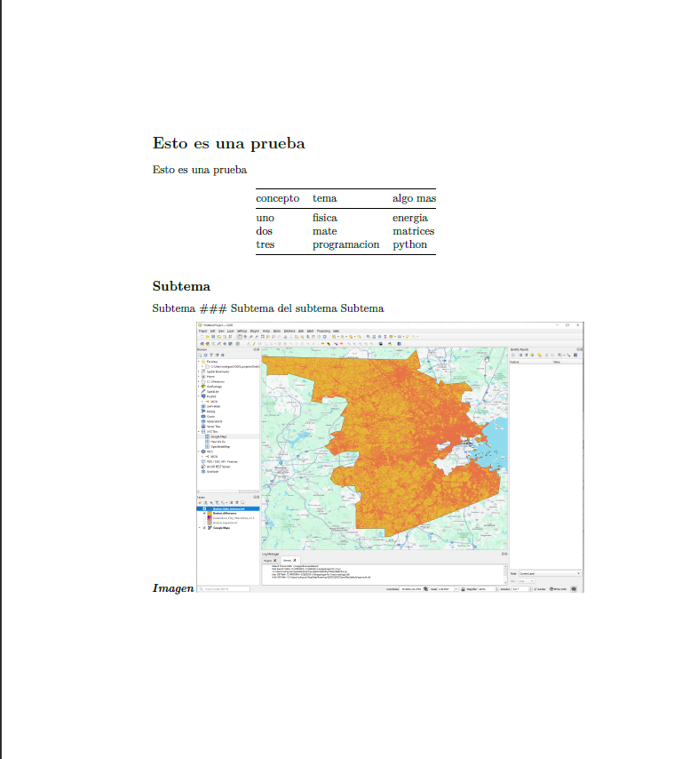

# Como convertir un archivo `.md` a `.pdf`.

## Abrir la terminal WSL
1. Actualizar paquetes con la siguiente línea: `sudo apt update`
2. Instalar Pandoc: `sudo apt install pandoc -y`
3. Verificar la instalación: `pandoc --version`
4. Instalar `LaTex` : `sudo apt install texlive texlive-latex-extra -y`
5. Convertir un archivo `mi_archivo.md`: `pandoc mi_archivo.md -o mi_archivo.pdf`

## Errores durante el proceso
### Error: pandoc: /img/ver.png: openBinaryFile: does not exist (No such file or directory)
Este error indica que se está haciendo referencia a una imagen como 
```markdown

```
Y `pandoc` está buscando la imagen en `/img/ver.png`, es decir la raíz del sistema de archivos, lo cual no es lo que se busca. Para solucionarlo, se debe usar rutas relativas correctas:
```markdown

```

Con esta corrección el proceso corre bien

## Error: LaTeX Error: Unicode character 🐍 (U+1F40D)
```bash
Error producing PDF.
! LaTeX Error: Unicode character 🐍 (U+1F40D)
               not set up for use with LaTeX.

See the LaTeX manual or LaTeX Companion for explanation.
Type  H <return>  for immediate help.
 ...

l.86 tres & programacion & python🐍
```

Se corrigió eliminando el caracter `🐍`
---

# Resultado 
Se obtuvo un archivo donde se observa:
1. Demasiada sangria
2. Respeta los headers 1 y 2
3. No respeta el header 3
4. Permite visualizar la imagen
5. Permite ver el texto en negrita y cursiva
6. No hay salto de página entre el texto y la imágen
7. Permite visualizar tablas

Ver resultado



## Tener en cuenta los siguientes detalles

Para que se visualicen los bullets, es necesario dejar un espacio entre el ultimo texto previo a los bullets:
```bash
Este es mi último texto:

* Bullet 1
* Bullet 2
* etc
```

